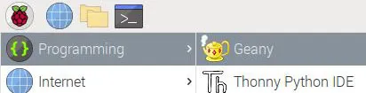
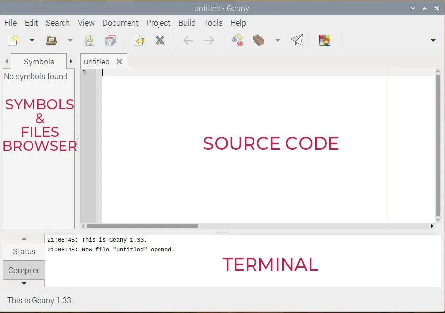
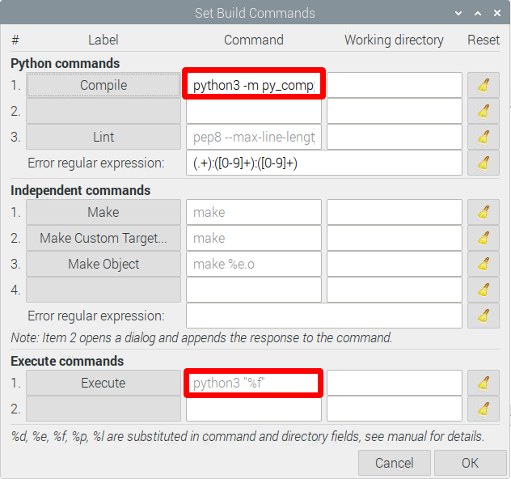

# Coding on the Raspberry Pi

If you are interested in coding directly on the Raspberry Pi, there are a ton of IDEs to choose from. To find them, open the main menu (top left of your screen), and click on programming. The two I recommend looking into are Geany and Thonny.

## [Thonny IDE](https://thonny.org/)
*Great for Python*

The Thonny IDE is a bit simpler, and their website has a ton of simple documentation, so I’ve linked it above. You’ll type source code in the main section, the bottom section is a terminal display, and the top are all the buttons to run your program. The biggest advantage is the built-in debugger, which allows you to step through your either line by line or by stopping at breakpoints in the code. This is essential when our code starts to get much larger. [Learn More](https://learn.sparkfun.com/tutorials/python-programming-tutorial-getting-started-with-the-raspberry-pi/hello-world).

## Geany IDE

The language of choice when programming a Raspberry Pi is usually python; however, this is not always the case, and the Geany IDE is a great multi-language IDE.

The Geany interface looks like this: This is standard for a code editor. You’ll type the source code in the main section. On the left there is a browser to see your files and variables. On the top you have the main menu, with essential shortcuts (you can customize this). And what’s interesting is the bottom part, where you can see the logs, and have a terminal on hand to run your scripts (perfect for Python for example).

There is one small edit you will want to make in order to have your python programs run with `python3`. Create a new file by going to *File > New (Ctrl + N)*, then save it by going to *File > Save As…* and name it **test.py**. Now go to *Build > Set Build Commands* and edit the two boxes show in red to the right by replacing `python` with `python3`. What this does is run python3 instead of python2 when executing the program. To run a program simply click the paper airplane shown below.
[Learn More](https://raspberrytips.com/use-geany-on-raspberry-pi/)

For even more information on other Raspberry Pi IDEs checkout [this article by Dzone.](https://dzone.com/articles/best-raspberry-pi-ides)
