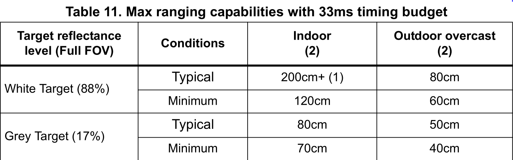

# Additional Kit Information

## LiPo Battery Information

Lithium Polymer (aka "LiPo") batteries are a type of battery now used in many consumer electronic devices. In the past few years, they have become more and more popular in the radio control industry and are now the most popular choice for anyone looking for long runtimes and high power. In fact, most phones today will use a LiPo Battery. However, the LiPo Batteries we will be using do not have the same safety mechanisms built into it. All that means is you should treat this battery with a bit more caution.

### Kit Specific

* When attaching your LiPo Battery to the WaveShare Servo Hat make sure the red wire attaches to VIN and the Black Wire Attaches to GND.
* Always attach the wires of the LiPo Battery Connector to the green terminal FIRST and then attach the LiPo Battery itself.

### General

* Do not puncture your LiPo Battery
* Keep your LiPo Battery Away from sources of heat (Don’t leave it in the sun)
* Always charge LiPo batteries on surfaces that won’t catch on fire such as cement, steel, ceramic or stone. Wooden tables and carpeted floors are not recommended charging surfaces.
* Do not charge batteries near flammable products or liquids.
* Never charge a LiPo battery while inside your model or other electronic device
* [More Information](https://www.genstattu.com/blog/lipo-lithium-battery-safety-guide)

## Lidar Sensor

## Datasheets

* [Datasheet for Lidar](https://cdn-learn.adafruit.com/assets/assets/000/037/547/original/en.DM00279086.pdf)
* [Datasheet for Ultrasonic Sensor](https://cdn.sparkfun.com/datasheets/Sensors/Proximity/HCSR04.pdf)
* [Datasheet for Raspberry Pi Zero W](https://www.electronicsdatasheets.com/datasheet/RPI-ZERO-V1_3_reduced.pdf)
* [Datasheet for ESP32](https://www.espressif.com/sites/default/files/documentation/esp32_datasheet_en.pdf)
* [Datasheet for Servo Driver Hat](https://www.waveshare.com/w/upload/1/1b/Servo_Driver_HAT_User_Manual_EN.pdf)
* [Data Sheet for Servo Motors](http://www.ee.ic.ac.uk/pcheung/teaching/DE1_EE/stores/sg90_datasheet.pdf)
