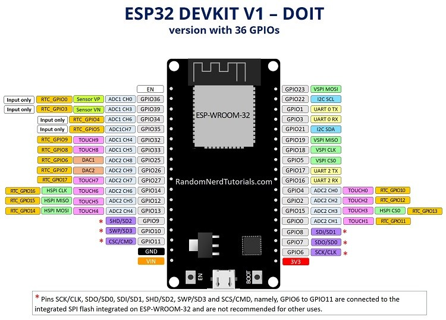

# ESP32

## Getting Started (ESP32)

1. If you don't have it already download and install the [Arduino IDE](https://www.arduino.cc/en/software)
2. Add the ESP32 Board to the Arduino Board Manager by URL. Use the Package Maintained by [Espressif Systems](https://dl.espressif.com/dl/package_esp32_index.json)
3. Select the Board and Port in the `Tools > Board` menu (`DOIT ESP32 DEVKIT V1`)
    * If you don’t see the COM Port in your Arduino IDE, you need to install the CP210x USB to UART Bridge VCP Drivers)
4. If you are planning on using Tufts_Wireless to connect this board to the internet, find it's MAC Address and register it with Tufts Technology Services.
5. There are a ton of great example codes to get you started programming in `File > Examples`

## Helpful Stuff

1. Connecting to WiFi from
   * `File > Examples > WiFi (ESP32) > WiFiScan`
   * `WiFi.macAddress()` returns the MAC Address of the device [/]
2. Using the ESP32 Dual Cores
   * The ESP32 comes with 2 Xtensa 32-bit LX6 microprocessors, so it’s dual core: (Core 0 and Core 1)
   * To use core 0 you need to create tasks
   * You can use the `xTaskCreatePinnedToCore()` function to pin a specific task to a specific core
   * Using this method you can run two different tasks independently and simultaneously using the two cores. [/]
3. The ESP32 Chip can run MicroPython; however, while running MicroPython you cannot take advantage of the Dual Cores
4. To run the Servo Motors use `ESP32_Arduino_Servo_Library` made by `RoboticsBrno`.
   * Download the repository and add it to your Arduino Libraries folder.
5. Getting Readings from the Distance Sensor
6. Getting Readings from the Lidar Sensor

## Important Links and Information (ESP32) [/]

* [Amazon Link](https://www.amazon.com/ESP32-WROOM-32-Development-ESP-32S-Bluetooth-Arduino/dp/B084KWNMM4)
* [Installing the ESP32 Board in Arduino IDE](https://randomnerdtutorials.com/installing-the-esp32-board-in-arduino-ide-windows-instructions/)
* [Board Manager URL](https://dl.espressif.com/dl/package_esp32_index.json)
* [Get ESP32 MAC Address](https://randomnerdtutorials.com/get-change-esp32-esp8266-mac-address-arduino/)
* [ESP32 Dual Core](https://randomnerdtutorials.com/esp32-dual-core-arduino-ide/)
* [MicroPython on ESP32](https://docs.micropython.org/en/latest/esp32/tutorial/intro.html#powering-the-board) (Careful: Cannot Use Both Cores of ESP32)

