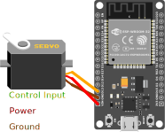

# ESP32

## Getting Started (ESP32)

1. If you don't have it already download and install the [Arduino IDE](https://www.arduino.cc/en/software)
2. Add the ESP32 Board to the Arduino Board Manager by [URL](https://randomnerdtutorials.com/installing-the-esp32-board-in-arduino-ide-windows-instructions/). Use the Package Maintained by [Espressif Systems](https://dl.espressif.com/dl/package_esp32_index.json)
3. Select the Board and Port in the `Tools > Board` menu (`DOIT ESP32 DEVKIT V1`)
    * If you don’t see the COM Port in your Arduino IDE, you need to install the CP210x USB to UART Bridge VCP Drivers)
4. If you are planning on using Tufts_Wireless to connect this board to the internet, [find it's MAC Address](https://randomnerdtutorials.com/get-change-esp32-esp8266-mac-address-arduino/) and register it with Tufts Technology Services.
5. There are a ton of great example codes to get you started programming in `File > Examples`

## Helpful Stuff

1. Connecting to WiFi from
   * `File > Examples > WiFi (ESP32) > WiFiScan`
   * `WiFi.macAddress()` returns the MAC Address of the device
2. Using the [ESP32 Dual Cores](https://randomnerdtutorials.com/esp32-dual-core-arduino-ide/)
   * The ESP32 comes with 2 Xtensa 32-bit LX6 microprocessors, so it’s dual core: (Core 0 and Core 1)
   * To use core 0 you need to create tasks
   * You can use the `xTaskCreatePinnedToCore()` function to pin a specific task to a specific core
   * Using this method you can run two different tasks independently and simultaneously using the two cores.
3. The ESP32 Chip can run [MicroPython](https://docs.micropython.org/en/latest/esp32/tutorial/intro.html#powering-the-board); however, while running MicroPython you cannot take advantage of the Dual Cores
4. Using the Servo Motors
   * To run the [Servo Motors](https://dronebotworkshop.com/esp32-servo/) use `ServoESP32` made by `RoboticsBrno (Jaroslav Paral)`.
   * Find it in the Library Manager `Sketch > Include Libraries > Manage Libraries`
   * Alternatively Download the repository and add it to your Arduino Libraries folder.
   * Refer to this wiring diagram. The orange wire Control can be connected to any digital IO pin.

5. Getting Readings from the [Ultrasonic Sensor](https://www.sparkfun.com/products/15569)
   * No library or demo code for this device, but examples can be found online!
   * Refer to this Wiring Diagram. 

6. Getting Readings from the Lidar Sensor
   * To get readings from the Lidar Sensor use the [Adafruit_VL53L0X Library](https://github.com/adafruit/Adafruit_VL53L0X)
   * To test if it is working open up **File > Examples > Adafruit_VL53L0X > vl53l0x** and upload to your Arduino wired up to the sensor
   * This sensor uses I2C communication. Refer to this Wiring Diagram to connect things up

7. Getting Readings from the [MPU9250](https://github.com/bolderflight/MPU9250)
   * To get readings from the ESP32 I used the library made by [Bolder Flight](https://github.com/bolderflight/MPU9250)
   * It can be found in the Arduino Library Manager called `Sketch > Include Libraries > Manage Libraries > Bolder Flight Systems MPU9250` Version 1.0.1
   * To test if it is working open up **File > Examples > Bolder Flight Systems MPU9250 > Basic_I2C** and upload to your Arduino wired up to the sensor. The numbers will appear in Serial.
   * This sensor uses I2C communication. Refer to this Wiring Diagram to connect things up

## Important Links and Information (ESP32)

* [Amazon Link](https://www.amazon.com/ESP32-WROOM-32-Development-ESP-32S-Bluetooth-Arduino/dp/B084KWNMM4)
* [Installing the ESP32 Board in Arduino IDE](https://randomnerdtutorials.com/installing-the-esp32-board-in-arduino-ide-windows-instructions/)
* [Board Manager URL](https://dl.espressif.com/dl/package_esp32_index.json)
* [Get ESP32 MAC Address](https://randomnerdtutorials.com/get-change-esp32-esp8266-mac-address-arduino/)
* [ESP32 Dual Core](https://randomnerdtutorials.com/esp32-dual-core-arduino-ide/)
* [MicroPython on ESP32](https://docs.micropython.org/en/latest/esp32/tutorial/intro.html#powering-the-board) (Careful: Cannot Use Both Cores of ESP32)
* [Controlling Servos](https://dronebotworkshop.com/esp32-servo/)
* [Getting Readings from Ultrasonic Distance Sensor](https://randomnerdtutorials.com/esp32-hc-sr04-ultrasonic-arduino/)
* [Getting Readings from Lidar](https://learn.adafruit.com/adafruit-vl53l0x-micro-lidar-distance-sensor-breakout/arduino-code)
* [Getting Readings from MPU9250](https://github.com/bolderflight/mpu9250)

