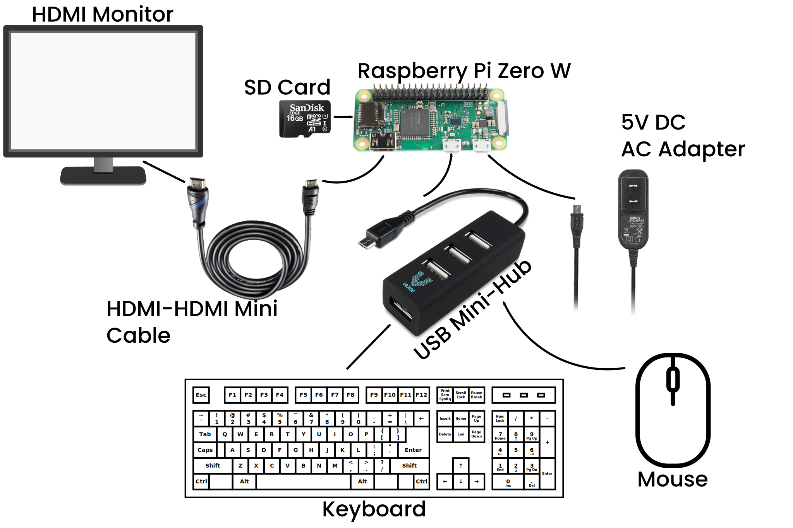
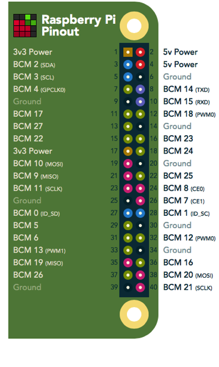
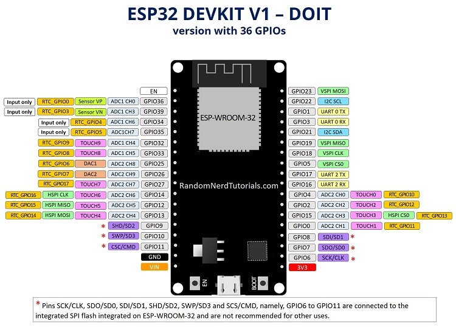

# ME 134 - Course Kit

A breakdown of the components contained in the ME134 kit, and helpful code snippets.

## Boards

### Raspberry Pi Zero Kit (Self Purchased)

#### Getting Started

1. Plug your SD Card into the Raspberry Pi
2. Connect your peripherals to the Raspberry Pi Zero W 
   * Plug the power cable in last
3. Wait - This part may take a bit of time, if it takes longer than 10 minutes. Disconnect the power cable and then reconnect
4. Follow the instructions in the dialog box, keeping the following in mind
    * Connect to Tufts_Wireless
    * Don't Check for Updates (It won't work as there is one more step to connect to the internet)
5. Find the Mac Address of your Raspberry Pi
    * Open up a terminal window and type `ifconfig wlan0`
    * Copy the MAC Address of your Raspberry Pi. Example: `2C:54:91:88:C9:E3`
6. Go to <https://it.tufts.edu/it-computing/wifi-network/manual-non-browser-device-registration>
    * Enter the MAC Address that you got from the Raspberry Pi and click Register
    * The registration can take a while to take affect ~15 minutes
7. Again in the command line of the Raspberry Pi copy and paste the following line of code `sudo apt update -y && sudo apt-get update -y && sudo apt-get upgrade -y && sudo apt dist-upgrade -y && sudo apt-get autoremove -y && sudo apt-get clean -y && sudo apt-get autoclean -y && sudo reboot`

#### Important Links and Information

* [Amazon Link](https://www.amazon.com/Vilros-Raspberry-Starter-Power-Premium/dp/B0748MPQT4)
* [YouTube Tutorial](https://www.youtube.com/watch?v=Hdm26W9dHK0)
* [Setup Page](https://maker.pro/raspberry-pi/tutorial/how-to-get-started-with-the-raspberry-pi-zero-w)
* My Kit did not come with headers for the Raspberry Pi [Same in Reviews](https://www.amazon.com/Vilros-Raspberry-Kit-Premium-Essential-Accessories/dp/B0748NK116/ref=sr_1_5?crid=1KENGVI6UOIVY&dchild=1&keywords=pi+zero+w+kit&qid=1630359207&s=electronics&sprefix=pi+zero+w%2Celectronics%2C184&sr=1-5)

### ESP32

#### Important Links and Information

* [Amazon Link](https://www.amazon.com/ESP32-WROOM-32-Development-ESP-32S-Bluetooth-Arduino/dp/B084KWNMM4)
* [Installing the ESP32 Board in Arduino IDE](https://randomnerdtutorials.com/installing-the-esp32-board-in-arduino-ide-windows-instructions/)
* [Get ESP32 MAC Address](https://randomnerdtutorials.com/get-change-esp32-esp8266-mac-address-arduino/)
* [ESP32 Dual Core](https://randomnerdtutorials.com/esp32-dual-core-arduino-ide/)
* [MicroPython on ESP32](https://docs.micropython.org/en/latest/esp32/tutorial/intro.html#powering-the-board) (Careful: Cannot Use Both Cores of ESP32)

### Raspberry Pi Servo Driver Hat

#### Important Links and Information

* [Amazon Link](https://www.amazon.com/Waveshare-Servo-Driver-Raspberry-Resolution/dp/B07GYFTKZD)
* [Pinout Diagram](https://pinout.xyz/pinout/waveshare_servo_driver_hat)

## Sensors

### Ultrasonic Distance Sensor - HC-SR04

#### Important Links and Information

* [Amazon Link](https://www.amazon.com/SainSmart-HC-SR04-Ranging-Detector-Distance/dp/B004U8TOE6)

### Lidar Sensor

#### Important Links and Information

* [Amazon Link](https://www.amazon.com/VL53L1X-Ranging-Distance-Measurement-Extension/dp/B08J1K9T5P/ref=sr_1_3?dchild=1&keywords=st+vl53l1x+lidar&qid=1630390129&sr=8-3)

## Miscellaneous

### Lipo Battery - Ovonic

#### Important Links and Information

* [Amazon Link](https://www.amazon.com/OVONIC-1500mAh-Battery-Airplane-Truggy/dp/B07CV95YFN)

#### Connector Bit

## Actuators

### Small Servo Motors

### Big Servo Motors
