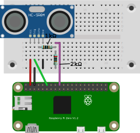
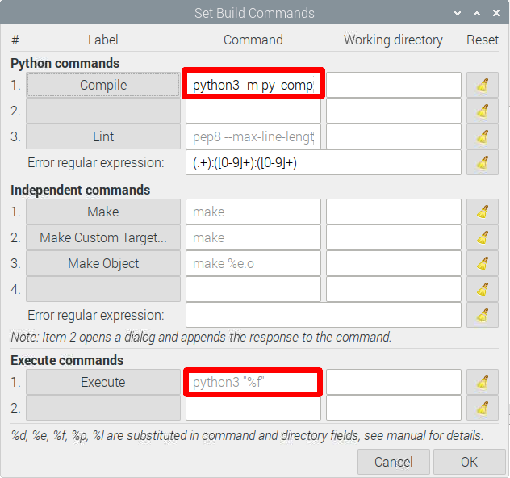
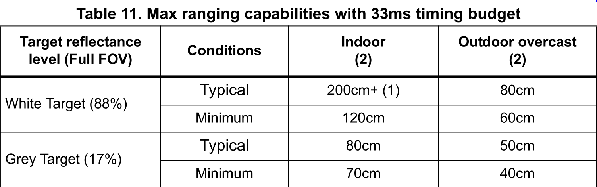

# ME 134 - Course Kit

You will have to solder the pins on to the board yourself, [Nolop](https://nolop.org/solder/) has access to several soldering stations. To interface with the Servo Hat, solder [MALE Pin headers](./public/male-pin-headers.jpg) to your board.

## Raspberry Pi Zero W

You will have to solder the pins on to the board yourself, [Nolop](https://nolop.org/solder/) has access to several soldering stations.

### Getting Started

1. Plug your SD Card into the Raspberry Pi
2. Connect your peripherals to the Raspberry Pi Zero W
   * Plug the power cable in last
   * The EPDC located in the SEC has computers, physically re-route the peripherals from one of the computers there to your Raspberry Pi Zero 
3. Wait - This part may take a bit of time, if it takes longer than 10 minutes. Disconnect the power cable and then reconnect
4. Follow the instructions in the dialog box, keeping the following in mind if you plan on connect to WiFi on Tufts Campus...
    * Connect to Tufts_Wireless
    * Don't Check for Updates (It won't work as there is one more step to connect to the internet)
    * Type `ifconfig wlan0` into the terminal window to find the MAC Address of your Raspberry Pi and register it with Tufts Technology Services via the online form.
5. Configure the following interface(s):
    * I2C (For Controlling the [Servo Hat](https://www.waveshare.com/wiki/Servo_Driver_HAT))
    * Serial (Optional)
    * VNC (Optional)
    * Type `sudo raspi-config` into the command line and navigate to *3 Interface Options*
6. Update the packages on your Raspberry Pi by opening a Terminal Window and entering the following line... `sudo apt update -y && sudo apt-get update -y && sudo apt-get upgrade -y`
7. `sudo reboot`


### Getting Started [Without a Monitor](https://howchoo.com/pi/raspberry-pi-gadget-mode)

1. Flash Raspberry PI OS onto your [SD Card](https://howchoo.com/pi/install-raspberry-pi-os)
2. Edit config.txt on the boot partition and append `dtoverlay=dwc2`
3. Enable SSH, on the command line in the boot directory type `touch ssh`
4. Edit `cmdline.txt` Look for `rootwait`, and add `modules-load=dwc2,g_ether` immediately after. Save and Exit
5. Connect over USB and boot the Pi
6. Follow the above instructions starting at 4.

## USING the Raspberry Pi Without a Monitor

1. First complete one of the getting started paths described above.
2. SSH MUST be enabled on your Raspberry Pi
3. Connect your computer to the same WiFi as your Pi.
4. Find the IP Address of your Pi on your local WiFi (On Tufts Wireless go to your Device Registration)
   * From the Pi, run `ifconfig` again and get the IP address
5. From your computer you can now *SSH Into Your Pi*
    * `ssh -l pi@<Your Pi’s IP Address>`

### Using the [Waveshare Servo Hat](https://www.waveshare.com/w/upload/1/1b/Servo_Driver_HAT_User_Manual_EN.pdf)

1. I2C should be enabled (see **Getting Started** Number 5)
2. Install the following libraries from the Terminal Window
    * Using `sudo apt-get`
      * `update`, `sudo apt-get upgrade`, `install python-pip `, `install python-smbus`, `install p7zip-full`
    * Using `pip install`
      * `RPi.GPIO`
3. Download example files

        sudo apt-get install p7zip-full
        wget http://www.waveshare.net/w/upload/6/6c/Servo_Driver_HAT.7z
        7zr x Servo_Driver_HAT.7z -r -o./RPi0_W/Servo_Driver_HAT
        sudo chmod 777 -R Servo_Driver_HAT
        cd Servo_Driver_HAT/Raspberry\ Pi/

4. Connect the hat to the top of the Raspberry Pi Zero
5. Connect one or more servos to the hat, using the following diagram.
   * **Every time you connect a servo to the Raspberry Pi it will restart**
   * The LiPo Battery Pack is only necessary if you want to operate without connecting the Raspberry Pi to power.
   * In order to make a connection between the LiPo and green Terminal I soldered two jumper cables to the end of the connector provided to you.


6. The LiPo Battery Pack is only necessary if you want to operate without connecting the Raspberry Pi to power.
    *	To make a connection between the LiPo and green terminal I soldered two jumper cables to the end of the connector.
    *	When attaching your LiPo Battery to the Waveshare Servo Hat make sure the Red wire attaches to VIN and the Black Wire Attaches to GND
    *	CAUTION: IF USING THE LIPO BATTERY SEE THE SECTION ON SAFETY PROCEDURES AT THE END OF THIS SHEET

### Getting Readings from the [Lidar Sensor](https://learn.adafruit.com/adafruit-vl53l0x-micro-lidar-distance-sensor-breakout/python-circuitpython)

1. pip install the `adafruit-circuitpython-vl53l0x` package

        sudo pip3 install adafruit-circuitpython-vl53l0x
2. To get reading import the adafruit_vl53l0x package and use the following commands

    ```python
      import board, busio, adafruit_vl53l0x

      ## Initialize I2C bus and sensor.
      i2c = busio.I2C(board.SCL, board.SDA)
      sensor = adafruit_vl53l0x.VL53L0X(i2c)

      ## Get Data
      sensor.range
    ```

3. Wiring Diagram
   * Pi 3V3 to sensor VIN (red wire on STEMMA QT version)
   * Pi GND to sensor GND (black wire on STEMMA QT version)
   * Pi SCL to sensor SCL (yellow wire on STEMMA QT version)
   * Pi SDA to sensor SDA (blue wire on STEMMA QT version)


### Getting Readings from the Ultrasonic Sensor

Like with the ESP32, there is no specific package used to manage the Ultrasonic Sensor HC-SR04. Instead you should wire it up as shown below and look for example code on the [internet](https://pimylifeup.com/raspberry-pi-distance-sensor/)!

* VCC Connects to Pin 2 (5v)
* Trig Connects to Pin 7 (GPIO 4)
* Echo Connects to R1 (1k Ω)
* R2 (2k Ω) Connects from R1 to Ground
* Wire from R1 and R2 connects to Pin 11
* GND connects to Pin 6 (Ground)



### Getting Started with the Camera

#### [Simple Pictures and Videos](https://projects.raspberrypi.org/en/projects/getting-started-with-picamera)

1. First make sure that the camera interface is enabled by typing, `sudo raspi-config` then select  **3 Interface Options**
2. Locate the Camera Module port
3. Gently pull up on the edges of the port’s plastic clip
4. Insert the Camera Module ribbon cable; make sure the connectors at the bottom of the ribbon cable are facing the contacts in the port.
5. Push the plastic clip back into place
6. Then try to get an image by typing

        $ raspistill -o Desktop/image.jpg

7. Now record a video with the Camera Module by using the following raspivid command:

        $ raspivid -o Desktop/video.h264

#### [Getting OpenCV](https://www.pyimagesearch.com/2015/03/30/accessing-the-raspberry-pi-camera-with-opencv-and-python/)

1. Next you want to install some dependencies

        $ sudo apt-get update && sudo apt-get upgrade
        $ sudo apt-get install libjpeg-dev libtiff5-dev libjasper-dev libpng-dev
        $ sudo apt-get install libavcodec-dev libavformat-dev libswscale-dev libv4l-dev
        $ sudo apt-get install libxvidcore-dev libx264-dev
        $ sudo apt-get install libfontconfig1-dev libcairo2-dev
        $ sudo apt-get install libgdk-pixbuf2.0-dev libpango1.0-dev
        $ sudo apt-get install libgtk2.0-dev libgtk-3-dev
        $ sudo apt-get install libatlas-base-dev gfortran
        $ sudo apt-get install libhdf5-dev libhdf5-serial-dev libhdf5-103
        $ sudo apt-get install libqtgui4 libqtwebkit4 libqt4-test python3-pyqt5
        $ sudo apt-get install python3-dev

2. Now pip install opencv

        $ pip3 install opencv-python

3. Now to use the library you can `import cv2` in a python file. For AI detection of face, bodies, etc. use *haarcascade*.

### Important Links and Information (RPi Zero W)

* [Amazon Link](https://www.amazon.com/Vilros-Raspberry-Starter-Power-Premium/dp/B0748MPQT4)
* [YouTube Tutorial](https://www.youtube.com/watch?v=Hdm26W9dHK0)
* [Setup Page](https://maker.pro/raspberry-pi/tutorial/how-to-get-started-with-the-raspberry-pi-zero-w)
* My Kit did not come with headers for the Raspberry Pi [Same in Reviews](https://www.amazon.com/Vilros-Raspberry-Kit-Premium-Essential-Accessories/dp/B0748NK116/ref=sr_1_5?crid=1KENGVI6UOIVY&dchild=1&keywords=pi+zero+w+kit&qid=1630359207&s=electronics&sprefix=pi+zero+w%2Celectronics%2C184&sr=1-5)
* [Using the Servo Motor](https://www.waveshare.com/w/upload/1/1b/Servo_Driver_HAT_User_Manual_EN.pdf)
* [Getting Readings from Lidar Sensor](https://learn.adafruit.com/adafruit-vl53l0x-micro-lidar-distance-sensor-breakout/python-circuitpython)
<!-- * [Datasheet of Lidar](https://cdn-learn.adafruit.com/assets/assets/000/037/547/original/en.DM00279086.pdf) -->
* [Getting Readings from the Ultrasonic Sensor](https://pimylifeup.com/raspberry-pi-distance-sensor/)
<!-- * [Datasheet of Ultrasonic Sensor](https://cdn.sparkfun.com/datasheets/Sensors/Proximity/HCSR04.pdf) -->

[](https://pinout.xyz/)

## Coding on the Raspberry Pi

If you are interested in coding directly on the Raspberry Pi, there are a ton of IDEs to choose from. To find them, open the main menu (top left of your screen), and click on programming. The two I recommend looking into are Geany and Thonny.


### [Thonny IDE](https://thonny.org/)

*Great for Python*

The Thonny IDE is a bit simpler, and their website has a ton of simple documentation, so I’ve linked it above. You’ll type source code in the main section, the bottom section is a terminal display, and the top are all the buttons to run your program. The biggest advantage is the built-in debugger, which allows you to step through your either line by line or by stopping at breakpoints in the code. This is essential when our code starts to get much larger. [Learn More](https://learn.sparkfun.com/tutorials/python-programming-tutorial-getting-started-with-the-raspberry-pi/hello-world).


### Geany IDE

The language of choice when programming a Raspberry Pi is usually python; however, this is not always the case, and the Geany IDE is a great multi-language IDE.


The Geany interface looks like this: This is standard for a code editor. You’ll type the source code in the main section. On the left there is a browser to see your files and variables. On the top you have the main menu, with essential shortcuts (you can customize this). And what’s interesting is the bottom part, where you can see the logs, and have a terminal on hand to run your scripts (perfect for Python for example).



There is one small edit you will want to make in order to have your python programs run with `python3`. Create a new file by going to *File > New (Ctrl + N)*, then save it by going to *File > Save As…* and name it **test.py**. Now go to *Build > Set Build Commands* and edit the two boxes show in red to the right by replacing `python` with `python3`. What this does is run python3 instead of python2 when executing the program. To run a program simply click the paper airplane shown below.
[Learn More](https://raspberrytips.com/use-geany-on-raspberry-pi/)


For even more information on other Raspberry Pi IDEs checkout [this article by Dzone.](https://dzone.com/articles/best-raspberry-pi-ides)

## ESP32

### Getting Started (ESP32)

1. If you don't have it already download and install the [Arduino IDE](https://www.arduino.cc/en/software)
2. Add the ESP32 Board to the Arduino Board Manager by [URL](https://randomnerdtutorials.com/installing-the-esp32-board-in-arduino-ide-windows-instructions/). Use the Package Maintained by [Espressif Systems](https://dl.espressif.com/dl/package_esp32_index.json)
3. Select the Board and Port in the `Tools > Board` menu (`DOIT ESP32 DEVKIT V1`)
    * If you don’t see the COM Port in your Arduino IDE, you need to install the CP210x USB to UART Bridge VCP Drivers)
4. If you are planning on using Tufts_Wireless to connect this board to the internet, [find it's MAC Address](https://randomnerdtutorials.com/get-change-esp32-esp8266-mac-address-arduino/) and register it with Tufts Technology Services.
5. There are a ton of great example codes to get you started programming in `File > Examples`

### Helpful Stuff

1. Connecting to WiFi from
   * `File > Examples > WiFi (ESP32) > WiFiScan`
   * `WiFi.macAddress()` returns the MAC Address of the device
2. Using the [ESP32 Dual Cores](https://randomnerdtutorials.com/esp32-dual-core-arduino-ide/)
   * The ESP32 comes with 2 Xtensa 32-bit LX6 microprocessors, so it’s dual core: (Core 0 and Core 1)
   * To use core 0 you need to create tasks
   * You can use the `xTaskCreatePinnedToCore()` function to pin a specific task to a specific core
   * Using this method you can run two different tasks independently and simultaneously using the two cores.
3. The ESP32 Chip can run [MicroPython](https://docs.micropython.org/en/latest/esp32/tutorial/intro.html#powering-the-board); however, while running MicroPython you cannot take advantage of the Dual Cores
4. Using the Servo Motors
   * To run the [Servo Motors](https://dronebotworkshop.com/esp32-servo/) use `ServoESP32` made by `RoboticsBrno (Jaroslav Paral)`.
   * Find it in the Library Manager `Sketch > Include Libraries > Manage Libraries`
   * Alternatively Download the repository and add it to your Arduino Libraries folder.
   * Refer to this wiring diagram. The orange wire Control can be connected to any digital IO pin.


5. Getting Readings from the [Ultrasonic Sensor](https://www.sparkfun.com/products/15569)
   * No library or demo code for this device, but examples can be found online!
   * Refer to this Wiring Diagram. 


6. Getting Readings from the Lidar Sensor
   * To get readings from the Lidar Sensor use the [Adafruit_VL53L0X Library](https://github.com/adafruit/Adafruit_VL53L0X)
   * To test if it is working open up **File > Examples > Adafruit_VL53L0X > vl53l0x** and upload to your Arduino wired up to the sensor
   * This sensor uses I2C communication. Refer to this Wiring Diagram to connect things up


7. Getting Readings from the [MPU9250](https://github.com/bolderflight/MPU9250)
   * To get readings from the ESP32 I used the library made by [Bolder Flight](https://github.com/bolderflight/MPU9250)
   * It can be found in the Arduino Library Manager called `Sketch > Include Libraries > Manage Libraries > Bolder Flight Systems MPU9250` Version 1.0.1
   * To test if it is working open **File > Examples > Bolder Flight Systems MPU9250 > Basic_I2C** and upload to your Arduino wired up to the sensor. The numbers will appear in Serial.
   * This sensor uses I2C communication. Refer to this Wiring Diagram to connect things up


### Important Links and Information (ESP32)

* [Amazon Link](https://www.amazon.com/ESP32-WROOM-32-Development-ESP-32S-Bluetooth-Arduino/dp/B084KWNMM4)
* [Installing the ESP32 Board in Arduino IDE](https://randomnerdtutorials.com/installing-the-esp32-board-in-arduino-ide-windows-instructions/)
* [Board Manager URL](https://dl.espressif.com/dl/package_esp32_index.json)
* [Get ESP32 MAC Address](https://randomnerdtutorials.com/get-change-esp32-esp8266-mac-address-arduino/)
* [ESP32 Dual Core](https://randomnerdtutorials.com/esp32-dual-core-arduino-ide/)
* [MicroPython on ESP32](https://docs.micropython.org/en/latest/esp32/tutorial/intro.html#powering-the-board) (Careful: Cannot Use Both Cores of ESP32)
* [Controlling Servos](https://dronebotworkshop.com/esp32-servo/)
* [Getting Readings from Ultrasonic Distance Sensor](https://randomnerdtutorials.com/esp32-hc-sr04-ultrasonic-arduino/)
* [Getting Readings from Lidar](https://learn.adafruit.com/adafruit-vl53l0x-micro-lidar-distance-sensor-breakout/arduino-code)
* [Getting Readings from MPU9250](https://github.com/bolderflight/mpu9250)

[](https://randomnerdtutorials.com/esp32-pinout-reference-gpios/)

## Additional Kit Information

### LiPo Battery Information

Lithium Polymer (aka "LiPo") batteries are a type of battery now used in many consumer electronic devices. In the past few years, they have become more and more popular in the radio control industry and are now the most popular choice for anyone looking for long runtimes and high power. In fact, most phones today will use a LiPo Battery. However, the LiPo Batteries we will be using do not have the same safety mechanisms built into it. All that means is you should treat this battery with a bit more caution.

#### Kit Specific

* When attaching your LiPo Battery to the WaveShare Servo Hat make sure the red wire attaches to VIN and the Black Wire Attaches to GND.
* Always attach the wires of the LiPo Battery Connector to the green terminal FIRST and then attach the LiPo Battery itself.

#### General

* Do not puncture your LiPo Battery
* Keep your LiPo Battery Away from sources of heat (Don’t leave it in the sun)
* Always charge LiPo batteries on surfaces that won’t catch on fire such as cement, steel, ceramic or stone. Wooden tables and carpeted floors are not recommended charging surfaces.
* Do not charge batteries near flammable products or liquids.
* Never charge a LiPo battery while inside your model or other electronic device
* [More Information](https://www.genstattu.com/blog/lipo-lithium-battery-safety-guide)

### Lidar Sensor



### Datasheets

* [Datasheet for Lidar](https://cdn-learn.adafruit.com/assets/assets/000/037/547/original/en.DM00279086.pdf)
* [Datasheet for Ultrasonic Sensor](https://cdn.sparkfun.com/datasheets/Sensors/Proximity/HCSR04.pdf)
* [Datasheet for Raspberry Pi Zero W](https://www.electronicsdatasheets.com/datasheet/RPI-ZERO-V1_3_reduced.pdf)
* [Datasheet for ESP32](https://www.espressif.com/sites/default/files/documentation/esp32_datasheet_en.pdf)
* [Datasheet for Servo Driver Hat](https://www.waveshare.com/w/upload/1/1b/Servo_Driver_HAT_User_Manual_EN.pdf)
* [Data Sheet for Servo Motors](http://www.ee.ic.ac.uk/pcheung/teaching/DE1_EE/stores/sg90_datasheet.pdf)
* [Data Sheet for MPU9250](https://invensense.tdk.com/wp-content/uploads/2015/02/PS-MPU-9250A-01-v1.1.pdf)
