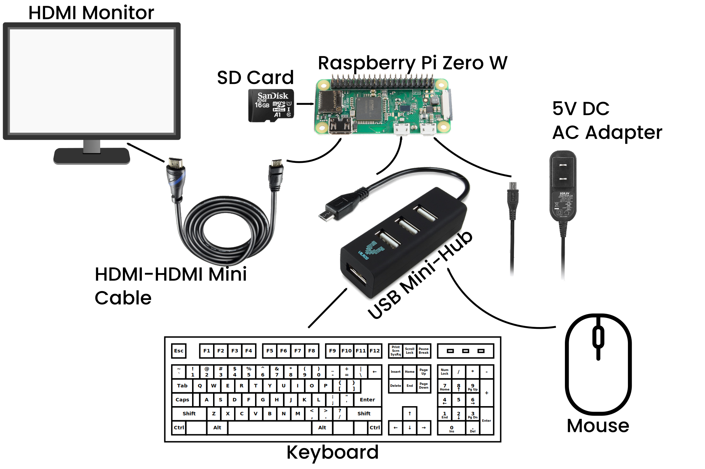
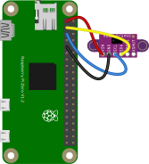
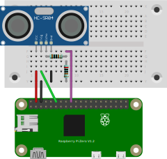
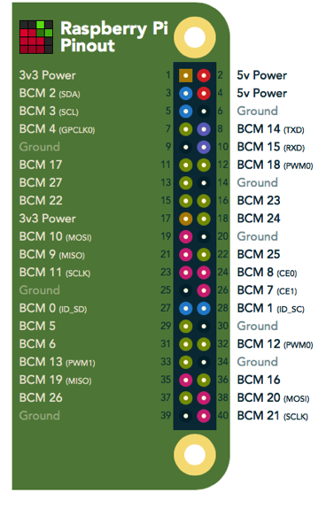

# Raspberry Pi Zero W

## Getting Started

1. Plug your SD Card into the Raspberry Pi
2. Connect your peripherals to the Raspberry Pi Zero W 
   * Plug the power cable in last
3. Wait - This part may take a bit of time, if it takes longer than 10 minutes. Disconnect the power cable and then reconnect
4. Follow the instructions in the dialog box, keeping the following in mind if you plan on connect to WiFi on Tufts Campus...
    * Connect to Tufts_Wireless
    * Don't Check for Updates (It won't work as there is one more step to connect to the internet)
    * Find the MAC Address of your Raspberry Pi and register it with Tufts Technology Services via the online Form
5. Configure the following interface(s):
    * I2C (For Controlling the [Servo Hat](https://www.waveshare.com/wiki/Servo_Driver_HAT))
    * Serial (Optional)
    * VNC (Optional)
    * SI : Type `sudo raspi-config` into the command line and navigate to *3 Interface Options*
6. Update the packages on your Raspberry Pi by opening a Terminal Window and entering the following line... `sudo apt update -y && sudo apt-get update -y && sudo apt-get upgrade -y`
7. `sudo reboot`

## Using the [Waveshare Servo Hat](https://www.waveshare.com/w/upload/1/1b/Servo_Driver_HAT_User_Manual_EN.pdf)

1. I2C should be enabled (see **Getting Started** Number 5)
2. Install the following libraries from the Terminal Window
    * Using `sudo apt-get`
      * `update`, `sudo apt-get upgrade`, `install python-pip `, `install python-smbus`, `install p7zip-full`
    * Using `pip install`
      * `RPi.GPIO`
3. Download example files

        sudo apt-get install p7zip-full
        wget http://www.waveshare.net/w/upload/6/6c/Servo_Driver_HAT.7z
        7zr x Servo_Driver_HAT.7z -r -o./Servo_Driver_HAT
        sudo chmod 777 -R Servo_Driver_HAT
        cd Servo_Driver_HAT/Raspberry\ Pi/

4. Connect the hat to the top of the Raspberry Pi Zero
5. Connect one or more servos to the hat, using the following diagram.
   * The LiPo Battery Pack is only necessary if you want to operate without connecting the Raspberry Pi to power.
   * In order to make a connection between the LiPo and green Terminal I soldered two jumper cables to the end of the connector provided to you.


## Getting Readings from the [Lidar Sensor](https://learn.adafruit.com/adafruit-vl53l0x-micro-lidar-distance-sensor-breakout/python-circuitpython)

1. pip install the `adafruit-circuitpython-vl53l0x` package

        sudo pip3 install adafruit-circuitpython-vl53l0x
2. To get reading import the adafruit_vl53l0x package and use the following commands

    ```python
      import board, busio, adafruit_vl53l0x

      # Initialize I2C bus and sensor.
      i2c = busio.I2C(board.SCL, board.SDA)
      sensor = adafruit_vl53l0x.VL53L0X(i2c)

      # Get Data
      sensor.range
    ```

3. Wiring Diagram 

## Getting Readings from the Ultrasonic Sensor

Like with the ESP32, there is no specific package used to manage the Ultrasonic Sensor HC-SR04. Instead you should wire it up as shown below and look for example code on the [internet](https://pimylifeup.com/raspberry-pi-distance-sensor/)!



## Important Links and Information (RPi Zero W)

* [Amazon Link](https://www.amazon.com/Vilros-Raspberry-Starter-Power-Premium/dp/B0748MPQT4)
* [YouTube Tutorial](https://www.youtube.com/watch?v=Hdm26W9dHK0)
* [Setup Page](https://maker.pro/raspberry-pi/tutorial/how-to-get-started-with-the-raspberry-pi-zero-w)
* My Kit did not come with headers for the Raspberry Pi [Same in Reviews](https://www.amazon.com/Vilros-Raspberry-Kit-Premium-Essential-Accessories/dp/B0748NK116/ref=sr_1_5?crid=1KENGVI6UOIVY&dchild=1&keywords=pi+zero+w+kit&qid=1630359207&s=electronics&sprefix=pi+zero+w%2Celectronics%2C184&sr=1-5)
* [Using the Servo Motor](https://www.waveshare.com/w/upload/1/1b/Servo_Driver_HAT_User_Manual_EN.pdf)
* [Getting Readings from Lidar Sensor](https://learn.adafruit.com/adafruit-vl53l0x-micro-lidar-distance-sensor-breakout/python-circuitpython)
* [Datasheet of Lidar](https://cdn-learn.adafruit.com/assets/assets/000/037/547/original/en.DM00279086.pdf)
* [Getting Readings from the Ultrasonic Sensor](https://pimylifeup.com/raspberry-pi-distance-sensor/)
* [Datasheet of Ultrasonic Sensor](https://cdn.sparkfun.com/datasheets/Sensors/Proximity/HCSR04.pdf)

[](https://pinout.xyz/)
